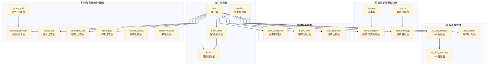

```mermaid
%%{init: {'theme': 'base', 'flowchart': {'htmlLabels': true, 'curve': 'linear'}, 'themeVariables': { 'fontSize': '18px', 'fontFamily': 'Microsoft YaHei' }}}%%
flowchart TB
    subgraph CENTER["核心业务表"]
        direction LR
        USER["user<br/>用户表"]
        BOOKLIST["booklist<br/>图书信息表"]
        BOOKITEM["book_item<br/>馆藏副本表"]
        LOANS["loans<br/>借阅记录表"]
    end

    subgraph TOP["图书分类与通知数据"]
        direction LR
        CATEGORY["category<br/>分类表"]
        BOOKCATEGORY["book_category<br/>图书分类关联表"]
        NOTICE["notice<br/>通知公告表"]
        MESSAGE["user_message<br/>用户消息表"]
    end

    subgraph LEFT["乡村服务数据"]
        direction TB
        DONATION["book_donation<br/>图书捐赠表"]
        WISH["book_wish<br/>缺书登记表"]
        FEEDBACK["user_feedback<br/>用户反馈表"]
    end

    subgraph RIGHT["AI 与推荐数据"]
        direction TB
        SESSION["ai_chat_session<br/>AI 会话表"]
        AIMSG["ai_chat_message<br/>AI 消息表"]
        ACTION["user_action<br/>用户行为表"]
    end

    subgraph BOTTOM["积分与系统维护数据"]
        direction LR
        TASK["points_task<br/>积分任务表"]
        CHECKIN["reading_checkin<br/>阅读打卡表"]
        LOGINLOG["login_log<br/>登录日志表"]
        OPLOG["operation_log<br/>操作日志表"]
        ERRORLOG["error_log<br/>异常日志表"]
        CONFIG["system_config<br/>系统配置表"]
        SENSITIVE["sensitive_word<br/>敏感词表"]
    end

    USER --> LOANS
    BOOKLIST --> BOOKITEM
    BOOKITEM --> LOANS

    BOOKLIST --> BOOKCATEGORY
    CATEGORY --> BOOKCATEGORY
    NOTICE --> MESSAGE
    USER --> MESSAGE

    USER --> DONATION
    USER --> WISH
    USER --> FEEDBACK

    USER --> SESSION
    SESSION --> AIMSG
    USER --> ACTION
    BOOKLIST --> ACTION

    TASK --> CHECKIN
    USER --> CHECKIN
    USER --> LOGINLOG
    USER --> OPLOG
    USER --> ERRORLOG

```